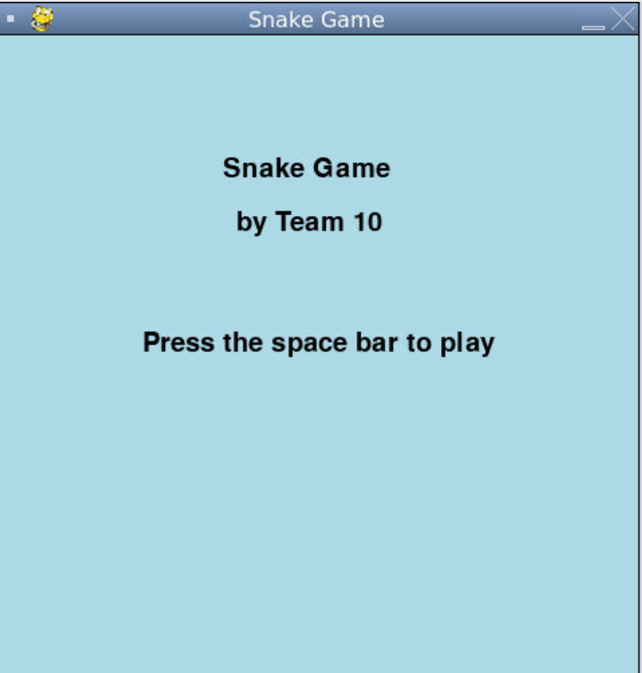
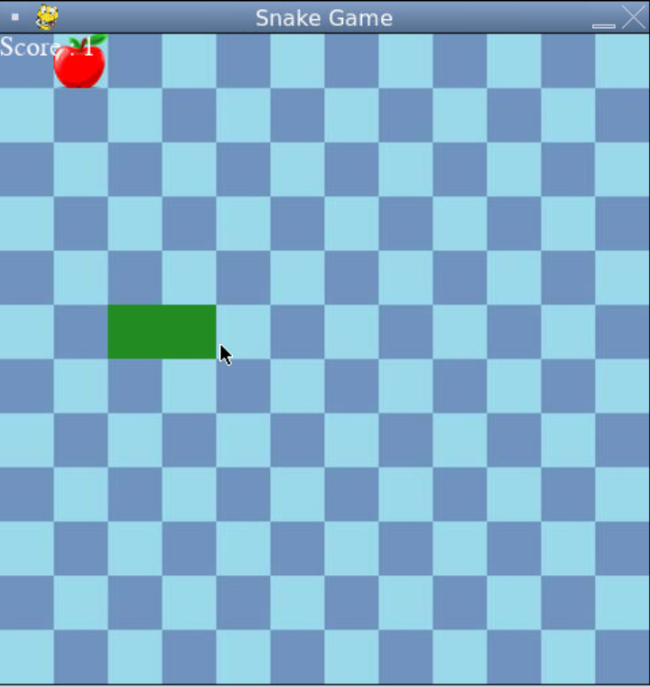
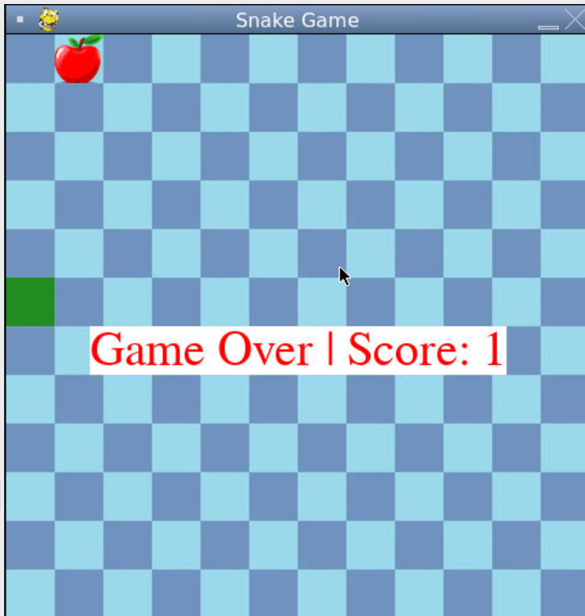

# CS110 Project Proposal
# Snake Game
## CS 110 Final Project
### Spring, 2022
### [Assignment Description](https://docs.google.com/document/d/1H4R6yLL7som1lglyXWZ04RvTp_RvRFCCBn6sqv-82ps/edit#)

[Replit Link](https://replit.com/join/ikvdjlwjwx-miayan)

[Demo presentation Slides](https://docs.google.com/presentation/d/1hSJARIv3SzEI46V6bj2UHlwYIM3N_5MJ7r4KJDbfDiY/edit?usp=sharing
) 

[Project Presentation](https://drive.google.com/file/d/1WDqpaQxwekYXuxBDd5gJdE5GG7NhO9bS/view?usp=sharing)

### Team: Team 10
#### Mia Yan, Nagima Dubanaeva, George Tzakas

***

## Project Description *(Software Lead)*

Our python project is a snake game inspired by the original arcade game, Blockade by Gremlim. Our game follows the same premise of the orignial in which the user controls a snake to collect apples. Our version of the game has an updated front-end design and the snake increases in speed after a score of 7. The snake moves around the screen on a grid using the arrow keys on their keyboard. The object of the game is to collect the highest number of apples. The game ends when the user crashes into the wall.

## User Interface Design *(Front End Specialist)*
- The opening screen(start screen) shows the name of the game and lets the user start the game

- In the main game screen, the user moves the snake around in order to collect food (apples)

- The last screen is the game over screen. When the user is done playing, it shows how many apples were collected, and the user's over all score.

 

### Our Final Gui Design:
  
* The start screen

* The main game window
  
* Game over screen
  
  
***        

## Program Design *(Backend Specialist)*

* Non-Standard libraries
    * Pygame - is a free and open-source cross-platform library for the development of multimedia applications like video games using Python.
    * Time - The Python time module lets you represent time in objects, numbers, and strings, as well as perform other useful tasks.
    * Random - Python Random module is an in-built module of Python which is used to generate random numbers.
      
* Class Interface Design 
      

* Classes
 
## Project Structure *(Software Lead)*

The Project is broken down into the following file structure:

* main.py
* src
    * apple.py
    * snake.py
    * Controller.py
* assets
    * apple.png
    * background.jpg
    * class_diagram.jpg
    * class_interface.png
    * ding.mp3
    * foldercontenxts.txt
* etc
    * Demo Video.mp4
    * foldercontents.txt
    * game_over_screen.png
    * game_window.png
    * project_classes.png
    * start_screen.png
    * start.jpg

***

## Tasks and Responsibilities *(Software Lead)*

   * The project was conceptualized and discussed amongst everyone. The tasks for each milestone were divided between the group. The ReadMe file was written together.

### Software Lead - Mia Yan

Worked as integration specialist by keeping the project to progress and getting everything done on time. Worked on designing the class diagram. Worked on the Controller class and the snake class.

### Front End Specialist - Nagima Dubanaeva

Front-end lead conducted significant research on the "skeleton" of the game and which classes we would need in order to the get the project together. Worked on the interface and the controller class 

### Back End Specialist - George Tzakas

The back end specialist worked on the final stages of the project and the controller. Worked on designing the class diagram and getting all of the classes that made up the project to work harmonically. Worked on the Apples and the Controller class

## Testing *(Software Lead)*

- We tested our program based on any errors discovered while running it on repl. Also, if the game worked based on how we expected it and designed  it. 
    * User based testing - we had to make sure that everything works, and debug the program by manually running the program.   

## ATP

| Step                  | Procedure     | Expected Results  | Actual Results |
| ----------------------|:-------------:|:-----------------| -------------- |
|  1  | opening run page  |   “Snake Game” appeas on the window   |          |
|  2  | The snake and the apples appear| The game starts with the snake and apples on the main game window |                |
|  3  | The user moves the snake | The user moves the snake to "eat" the apples |                 |
|  4  | The user enters "UP" arrow  | the snake moves up |                 |
|  5  | The user enters "down" arrow  | the snake moves down |                 |
|  6  | The user enters "right" arrow  | the snake moves to the right |                 |
|  7  | The user enters "left" arrow  | the snake moves to the left |                 |
|  8  | The user hits the wall   | Once the user runs into the walls of the game, it ends. The word “Game over, Score: x” appear.|      |
 
