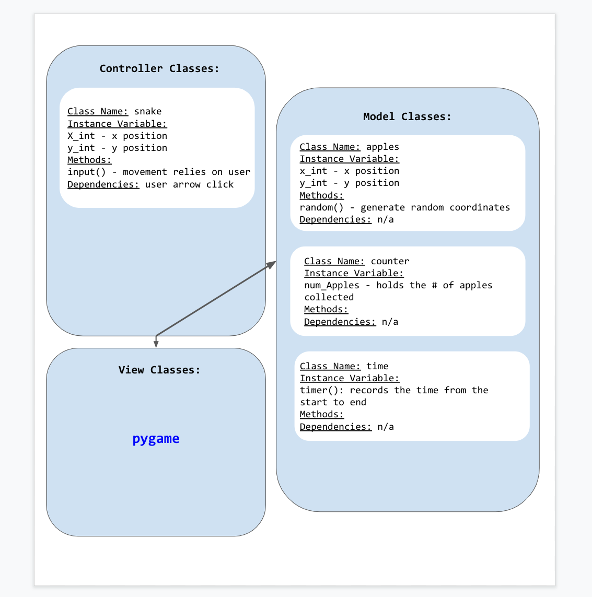

:warning: Everything between << >> needs to be replaced (remove << >> after replacing)
# CS110 Project Proposal
# Snake Game
## CS 110 Final Project
### Spring, 2022
### [Assignment Description](https://docs.google.com/document/d/1H4R6yLL7som1lglyXWZ04RvTp_RvRFCCBn6sqv-82ps/edit#)

[repl](https://replit.com/join/ikvdjlwjwx-miayan)

<< [link to demo presentation slides](https://docs.google.com/presentation/d/1hSJARIv3SzEI46V6bj2UHlwYIM3N_5MJ7r4KJDbfDiY/edit?usp=sharing) >>

### Team: Team 10
#### Mia Yan, Nagima Dubanaeva, George Tzakas

***

## Project Description *(Software Lead)*

The game we worked on for this project is the relatively simple and well known “Snake Game”. The main groundwork of this game is that the user moves the snake around the window in order to eat the apples; and obtain the highest possible score before the timer runs out.

***    

## User Interface Design *(Front End Specialist)*

    
- The opening screen(start screen) shows the name of the game and lets the user start the game

- In the main game screen, the user moves the snake around in order to collect food (apples)

- The last screen is the game over screen. Once the timer runs out, the last window shows how many apples were collected and their over all score. 

* << You should also have a screenshot of each screen for your final GUI >>

***        

## Program Design *(Backend Specialist)*

* Non-Standard libraries
    * << You should have a list of any additional libraries or modules used (pygame, request) beyond non-standard python. >>
    * For each additional module you should include
        * url for the module documentation
        * a short description of the module
* Class Interface Design
    * << A simple drawing that shows the class relationships in your code (see below for an example). >>
        * 
    * This does not need to be overly detailed, but should show how your code fits into the Model/View/Controller paradigm.
* Classes
    * << You should have a list of each of your classes with a description. >>

## Project Structure *(Software Lead)*

The Project is broken down into the following file structure:

* main.py
* src
    * <all of your python files should go here>
* assets
    * <all of your media, i.e. images, font files, etc, should go here)
* etc
    * <This is a catch all folder for things that are not part of your project, but you want to keep with your project. Your demo video should go here.>

***

## Tasks and Responsibilities *(Software Lead)*

   * You must outline the team member roles and who was responsible for each class/method, both individual and collaborative.

### Software Lead - Mia Yan

<< Worked as integration specialist by... >>

### Front End Specialist - Nagima Dubanaeva

<< Front-end lead conducted significant research on... >>

### Back End Specialist - George Tzakas

<< The back end specialist... >>

## Testing *(Software Lead)*

* << Describe your testing strategy for your project. >>
    * << Example >>

## ATP

| Step                  | Procedure     | Expected Results  | Actual Results |
| ----------------------|:-------------:|:-----------------| -------------- |
|  1  | opening run page  |  The timer and “Snake Game” appear on the window   |          |
|  2  | The snake and the apples appear| The game starts with the snake and apples on the main game window |                 |
|  3  | The user moves the snake | The user moves the snake to "eat" the apples |                 |
|  4  | the timer runs out   | once the timer runs out the game ends |                 |

